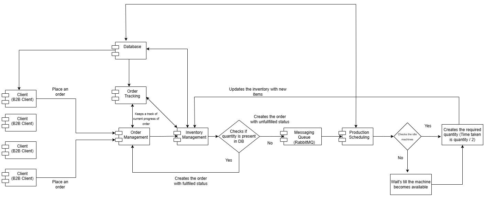

# Smart Manufacturing Management System

## Architecture Diagram

## Overview
A distributed microservices-based backend system designed to manage manufacturing operations, including order processing, inventory tracking, production scheduling, and real-time status updates.

The system leverages event-driven architecture using RabbitMQ to enable scalable and loosely coupled communication between services.

---

## Architecture
The system consists of the following microservices:

- **Order Management** – Handles order creation and lifecycle
- **Inventory Management** – Tracks stock levels and updates
- **Order Tracking** – Provides real-time tracking of orders
- **Production Scheduling** – Manages manufacturing workflows
- **Queue Service** – Handles asynchronous communication via RabbitMQ

---

## Tech Stack
- **Backend:** Java, Spring Boot  
- **Messaging:** RabbitMQ  
- **Database:** PostgreSQL  
- **Containerisation:** Docker  
- **Orchestration:** Docker Compose  

---

## Key Features
- Microservices-based architecture with clear service boundaries  
- Event-driven communication using RabbitMQ  
- Reduced processing latency by **44%** by replacing synchronous calls with messaging  
- Optimised PostgreSQL queries improving performance by **50%**  
- Containerised services for reproducible local deployment  

---

